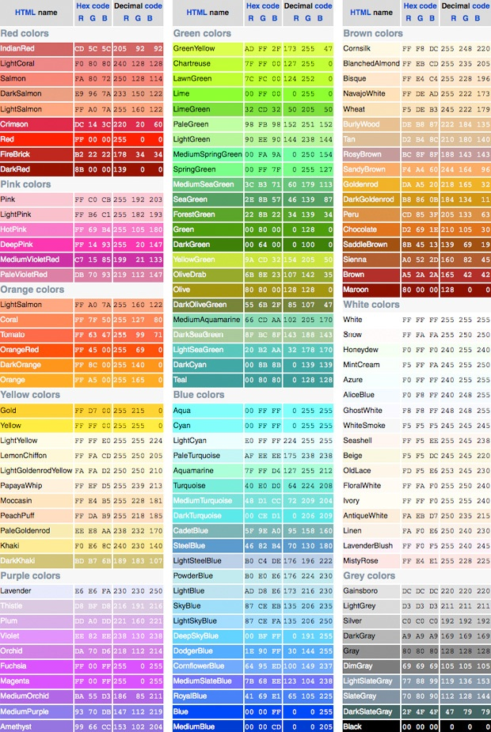

# Lesson 2: Styling Web Pages

## Inline Styling

**Introducing the** ***style*** **attribute**

So far we've created structured text, but we want our website to be **stylish** *and* structured.

There are three general ways to style [CSS](https://developer.mozilla.org/en-US/docs/Web/CSS)

The first way is using the in-line HTML style attribute like in the example below:

Write (don't copy and paste! That's only cheating yourself) the following into a new HTML document and see what it looks like.

```html
<body style="background-color:lightgrey">
<h1 style="color:blue">This is a heading</h1>
<h1 style="color:#AA22FF">Also a heading</h1>
<h1 style="color:rgb(0,255,255)">Moar!!</h1>
<p style="color:red;background-color:green">This is a paragraph.</p>

```

What does the code above demonstrate?

1. The value of the HTML attribute named `style` styles HTML elements
2. The styles are described using a language called CSS. Here are the rules of CSS:
  1. CSS rules are key-value pairs (similar to HTML attributes).
  2. The key represents the property to be changed (like 'color' or 'background-color').
  3. The value represents what it should be changed to ('blue' or 'red').
  4. The key and value are separated by a colon
  5. Each key-value pair is separated with a semi-colon
3. Colors can be defined in three [different ways](https://developer.mozilla.org/en-US/docs/Web/CSS/color), and there are many online tools that will help you [pick colors](https://developer.mozilla.org/en-US/docs/Web/CSS/Tools/ColorPicker_Tool). The three ways are:
  1. By their literal name  
  2. Red Green Blue triplets from 0 to 255
  3. Eight digit hex (base 16) values between 0 (black) and F (white)



### Exercise: My (fictional) vacation

1. Create a web page recounting the (potentially fabricated) vacation you might have recently taken.
2. This should be the world's most fabulously colorful web page!
3. Desribe some celebrity encounters that you may have had.
4. Catalogue your outrageous adventures and extreme sporting triumphs.
5. If you shifted into any film or book-inspired alternative universes or encountered otherworldly beings, include photo documentation.
6. Use all three styles of declaring CSS colors.
7. There should be atleast 20 HTML elements on the page.
8. Some elements should be nested at least three layers deep.
9. Include some links to other websites.
10. Throw some animated gifs or Richard Simmons dancing on there or something crazy like that.
11. Don't forget some secret comments!
12. HAVE FUN WITH YOUR WORK! We're web developers, dammit, not morticians!
13. Read some of your classmate's source code. Did anybody do something particularly clever?

A little inspiration for you:


If you're truly lacking inspiration, check out this [ridicuously exhaustive list of CSS properties](https://developer.mozilla.org/en-US/docs/Web/CSS/Reference). See if any of them sound interesting to you.

### More in-line styling

Similar to before, **WRITE** the following into a fresh HTML document:

```html
<h1 style="font-family:verdana;color:orange;">This is a heading</h1>
<p style="color:green;">This <i style="color:orange;font-size:300%">is</i> a paragraph.</p>
<p style="color:green;">This <i style="font-size:300%;">is</i> a paragraph.</p>
<p style="color:green;font-size:40px;text-align:center;font-family:'Times New Roman';">This is a paragraph.</p>
```

What did we learn?

1. Styles applied to **parent** elements effect their **children** (nested) elements, unless that style is overwritten.

2. We can put a lot of Styles on a single HTML element, but it gets messy.

3. We can apply the same style to every tag of a particular type (all paragraphs should be green), but we have to reapply it on each element.

Think over the last two points. How can we improve the situation? We'll look at the solution the designers of CSS chose in the next section.

## Better styling with the `<style>` tag

Let's start with the following code from the previous section:

```html
<html>
  <head>
  </head>
  <body>
    <h1 style="font-family:verdana;color:orange;">This is a heading</h1>
    <p style="color:green;">This <i style="color:orange;font-size:300%">is</i> a paragraph.</p>
    <p style="color:green;">This <i style="font-size:300%;">is</i> a paragraph.</p>
      <p style="color:green;font-size:300%;text-align:center;font-family:'Times New Roman';">This is by far the most important part of the page!</p>
    </body>
  </html>
  ```

  CSS rules can be applied to an entire HTML page by placing them inside a `<style>` element inside the `<head>` element of the page.

  We begin with a **selector** to indicate which elements the rule apply to. Then, inside of curly braces, we indicate how the elements should be styled. Declarations are split into two parts (a property and a value), are separated by a colon, and end with a semicolon (just like the inline style attributes.)

  ```html
  <html>
      <head>
      <style>
        h1 {
          font-family: verdana;
        }
        p {
          color: green;
        }
        i {
        font-size: 300%;
      }
    </style>
  </head>
  <body>
    <h1 style="color:orange;">This is a heading</h1>
    <p>This <i style="color:orange;">is</i> a paragraph.</p>
    <p>This <i>is</i> a paragraph.</p>
    <p style="font-size:300%;text-align:center;font-family:'Times New Roman';">This is by far the most important part of the page!</p>
  </body>
</html>
```

Ok, so far, so good. We have styles common to tags of the same type as shared styles. How can we represent all the extra styling on that last `<p>` tag?

Every HTML element can carry an **id attribute** to uniquely identify it. No two elements on the same page may have the same value for their id attributes. The css selector to match for an **id** starts with a hash.

```html
<html>
  <head>
  <style>
    h1 {
      font-family: verdana;
    }
    p {
      color: green;
    }
    i {
      font-size: 300%;
    }
    #primary {
      font-size: 300%;
      text-align: center;
      font-family: 'Times New Roman';
    }
  </style>
  </head>
  <body>
  <h1 style="color:orange;">This is a heading</h1>
  <p>This <i style="color:orange;">is</i> a paragraph.</p>
  <p>This <i>is</i> a paragraph.</p>
  <p id="primary">This is by far the most important part of the page!</p>
  </body>
</html>
```

Ok, now what about the two oranged elements?

Every HTML element can also carry one or more class names in a **class attribute** to identify several elements as being different from the other elements on the page. The `css selector` to match for a class starts with a period.

```html
<html>
  <head>
  <style>
    h1 {
      font-family: verdana;
    }
    p {
      color: green;
    }
    i {
      font-size: 300%;
    }
    #primary {
      font-size: 40px;
      text-align: center;
      font-family: 'Times New Roman';
    }
    .important {
      color: orange;
    }
  </style>
  </head>
  <body>
    <h1 class="important">This is a heading</h1>
    <p>This <i class="important">is</i> a paragraph.</p>
    <p>This <i>is</i> a paragraph.</p>
    <p id="primary">This is by far the most important part of the page!</p>
  </body>
<html>
```

Elements can have more than one class, but should only ever have a single id. **Why is that?**

```html
<html>
  <head>
  <style>
    h1 {
        font-family: verdana;
    }
    p {
      color: green;
    }
    .big {
      font-size: 300%;
    }
    #primary {
      text-align: center;
      font-family: 'Times New Roman';
    }
    .important {
      color: orange;
    }
  </style>
  </head>
  <body>
    <h1 class="important">This is a heading</h1>
    <p>This <i class="important big">is</i> a paragraph.</p>
    <p>This <i class="big">is</i> a paragraph.</p>
    <p  id="primary" class="big">This is by far the most important part of the page!</p>
  </body>
<html>
```

Now we have separated **presentation** from **content**. We can easily read the content of our HTML document without it being cluttered up with styles. By sharing styles we also save ourselves a lot of typing as we create larger and larger HTML documents.

### Exercise: Vacation Refactor

Revisit all of the HTML code you have written so far and purge your HTML elements of "style" attributes. Move all styling to a `<style>` tag in the `<head>` and look for (or change your code to create) opportunities to use **id** and **class** attributes.

## More Fun with HTML

`<a href=""></a>` **links** can specify a [protocol](https://en.wikipedia.org/wiki/Communications_protocol) by which to process the URL. Most often we use the [HTTP protocol](https://en.wikipedia.org/wiki/Hypertext_Transfer_Protocol): `http:` or `https:` and the browser responds by throwing away the current HTML document, then sending a network request to fetch the new HTML document which it then parses into a [DOM](https://developer.mozilla.org/en-US/docs/Web/API/Document_Object_Model/Introduction) and renders it into the browser's viewport.

The `mailto:` protocol will instead tell the browser to open a new email message and populate the `to:` field with the email address.

```html
<a href="http://pbskids.org/rogers/videos/">Visit Mr. Roger's Neighborhood</a>
<a href="mailto:mr.rogers@neverland.com?Subject=My%20hero">Email Mr. Rogers</a>
```

### Exercise: Mr. Rogers Page

1. Try out the code snippet above in a new HTML document, call it "Mr. Rogers Neighbourhood". Make you sure you type everything out yourself, and include `<html>`, `<head>`, and `<body>` tags.

2. Add a link to your personal website so that users can send you an email.

## Embedding

`<iframe>` **tags** let you embed an entire HTML document inside your page.

```html
<iframe src="http://www.weather.gov/" width="800" height="300"></iframe>
<iframe src="http://example.com" width="200" height="200" style="border:none"></iframe>
```

Note that the site linked in the `src` attribute must consent to be displayed. So this may not work with all websites.*

### Exercise: Embedding

Try to embed some cool stuff into your personal or vacation site! Some ideas:

1. Embed some of your favorite websites directly using iframes
2. Embed a [YouTube Video](https://support.google.com/youtube/answer/171780?hl=en)
3. Embed a [Google Map](https://support.google.com/maps/answer/3544418?hl=en)

**Debugging Tip:** If you think you embedded something properly, but nothing shows up inside the iframe, open up your chrome developer tools and take a look at the console log to see if there were any errors!


### Audio Tags

`<audio>` tags allow us to embed a music file:

<audio controls>
  <source src="resources/simplicity.mp3" type="audio/mpeg">
</audio>

```html
<audio controls>
  <source src="http://www.stephaniequinn.com/Music/Commercial%20DEMO%20-%2015.mp3" type="audio/mpeg">
</audio>
```

### Exercise: Media Page!

Create a Media page about anything you want! It should contain pictures, audio, and video relevant to your community. Maybe educational content, and perhaps some fun stuff too. Include short explanations of each piece of content:

1. Include YouTube videos of interest to your target audience

2. Add some .mp3 audio files (if you're looking for a song to download, I like [this one](https://www.jamendo.com/en/track/579315/simplicity))

3. In the `<style>` tag, apply a few css styles to each of the following:

```css
body {

}

h1 {

}

p {

}
```

4. Use at least 5 distinct id attributes and at least 2 class attributes to style the page, for example:

```css
#lead-video {

}

.video-container {
}

.caption {

}
```

5. The id attributes should refer exactly to one HTML element a piece

6. The class attributes could refer to 0 or 1 HTML elements, but let's have at least two or three elements with the same class.

### The Background CSS property

The **background CSS property** can set background properties other than just color: color, image url, repeat, and position, among others.

```css
body {
  background: #000000 url("http://fanaru.com/doge/image/18361-doge-follow-your-dreams.jpg") no-repeat fixed center;
}
```

### Exercise: Background url

Create a new HTML document and style the body using the code snippet in the "Background CSS property" section above. What does it look like?

### Exercise: More from Mr. Rogers

1. Expand the Mr. Roger's neighborhood page to give Mr. Rogers the online remembrance he deserves!

2. Use a background image on the body

3. Use another background image on a div which has text content inside it

4. Give that div a class or id and in the `<style>` tag give it a fixed width and height

5. Don't be afraid to get in there and really *praise* Mr. rogers. *He truly was an amazing human being.*


## Extra Credit

+ You may have noticed that the `mailto` protocol opens the users native email client. Many users don't have a native email client, but manage all their email through web applications like Gmail. Go to [Craigslist](www.craigslist.org), find any random posting, and then click the "reply" button in the top left of the screen. Try clicking the Gmail button. Notice how (if you're logged in) it opens up a new email in your Gmail web application? Try to reverse engineer that link to work on your own website. **Hint:** Take the URL of the link and paste it into your text editor. Study it and see how it relates to the actual Craigslist posting and the email template that is generated. What could you change to make it suit your own purposes?

+ Learn more about the Command Line Interface (CLI) and Bash scripting with [this resource](http://cli.learncodethehardway.org/book/)

+ Learn too use [CSS transitions](https://developer.mozilla.org/en-US/docs/Web/Guide/CSS/Using_CSS_transitions). If you have trouble reading the documentation, try looking online for a simple tutorial.

## Additional Reading

1. File Transfer Protocol (FTP)
2. HyperText Transfer Protocol
3. REST API

\* *Although, there are way to get even non-cooperative websites to play nice if you're motivated enough...*