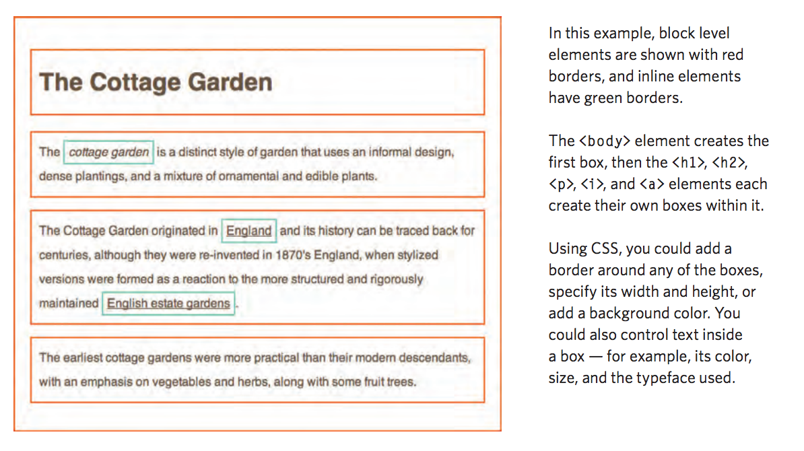
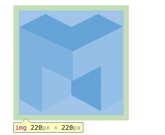

# Larger Web Documents

## Multi-Section Web Pages

Now that we've learned about styling, let's think about how to build larger web pages in an orderly manner.

```html
<div id="greeting" class="section">
  <h1>Hello!</h1>
  <p>This content is all related!</p>
  <p>Nice that we can group it using a "div" tag!</p>
</div>
```

The `<div>` element is a generic [block element](https://developer.mozilla.org/en-US/docs/Web/HTML/Block-level_elements) which defines a section of your page. Unlike block elements with specific meaning and implied default styling (like `<h1>` and `<p>` tags), `<div>` elements don't change the apperance of the page until styles are applied to them.

```html
<p>Sometimes, <span class="highlight">all we really want</span> is
to be able to refer to certain sections of our page, but we want to completely
<span class="highlight">control their styling</span>, and not get the
"b" or "i" tags involved</p>
```

The `<span>` element is a generic [inline element](https://developer.mozilla.org/en-US/docs/Web/HTML/Inline_elements) which defines a section of your page. Unlike inline elements with specific meaning and default styling (like `<b>` and `<i>` tags), `<span>` elements don't change the apperance of the page until styled are applied to them.

### Exercise: Blog Post

Lets add a blog post to your website. It can be about anything you want!

1. The blog post should have a header area, a nav bar area, a content area, and a footer area (contact info or something like that can go here). Each of those areas should be contained within its own `<div>` tag.

2. The content area should have multiple header and paragraph tags. Add some styles for each tag type.

3. Give each `<div>` its own id attribute ("header", "nav", "content" and "footer"), and style each a little. For example, they could each have a different background color.

4. Add some generic `<span>` tags around bits of important text. Give each a class of "important", and style them so that information stands out! Maybe a yellow background, red text, a heaver font-weight, and a slightly larger font-size.

5. Add some `<span>` tags around bits of un-important text. Give each a "nice-to-know" class, and style that text a bit lighter and smaller.

## The CSS Box Model



Every HTML element is a rectangular box, even if you cannot see it. This is referred to as the [CSS Box Model](https://developer.mozilla.org/en-US/docs/Web/CSS/box_model). In the box model, each box has four edges:

1. The edge of the content
2. The edge of the padding
3. The edge of the border
4. The edge of the margin

The content edge is the easiest to understand, its simply the inner rectangle that is defined by the *content* of the element. An `` element's content edge, for example, would be defined by the dimensions of the actual image. Inspect the element below to see:


You can think of the padding as extending the content in the box. If the content has a background or color, this will expand into the padding.

Using the chrome dev tools, add `padding: 10px` to the style properties.


Now when you look at the element in the chrome dev tools, there should be a green padding box surrounding the blue content box.



In the developer console, you can also see the computed values of each edge of the box model by clicking on the "Computed" tab next to the "Styles" tab.


What other ways can you manipulate the padding? The [padding documentation](https://developer.mozilla.org/en-US/docs/Web/CSS/padding) might give you some ideas.

The border edge is pretty easy to understand. Try playing around with the following styles in the developer tools and seeing what happens:

1. border-radius: 10px
2. border-left: 10px solid red;

Once you've got those working, take a look at the [border documentation](https://developer.mozilla.org/en-US/docs/Web/CSS/border) and figure out what else you can do.

The last edge, [margin](https://developer.mozilla.org/en-US/docs/Web/CSS/margin), is special because it doesn't affect the size of computed box, but it does affect how boxes interact with each other. Go ahead and try it, add `margin-bottom:50px` to something and see what happens to the rest of the content on the page. Also take notice to how the highlighted box model of the element doesn't grow any larger, like it did when we modified the padding and border.

### Exercise: Blog Post Refactor

1. Go back to your blog post HTML file and added some border, padding, margins, and general styling.
2. Make it look nice, give things room to breathe, and make sure you understand how the box model really works. 
3. Inspect the computed boxes of all your work in developer tools once you're done, or even better, use the chrome developer tools to preview what changes will look like before commiting them to your CSS.
4. Wrap all of the content of your page in a div, give it an id of "container", and then apply the following CSS styles to it: `width:960px; margin: 0 auto;`. What did this do? Why did it do it? Why might we want that? Try changing it to `max-width:960px; margin: 0 auto;` Notice a difference? If not, try resizing the browser window and making it really small, or using the **Device Mode** setting in the Chrome Developer tools (open up Chrome Developer tools and click the phone icon in the top left).


If you have extra time, try adding some fake comments at the end of your blog post:

1. Fill the comment section with admiring comments
2. Some comments should have replies. Figure out how to indent them 20px.
3. Nest replies multiple levels deep to create the illusion of a lively conversation!

### Exercise: A Very Boxy Page

1. Create a bunch of divs and spans on your page.
2. This is a web page about boxes. Add content about boxes. Cardboard boxes, metal boxes, self-imposed emotional boxes, whatever...
3. Using a mix of class, id, and tag selectors, give boxes different background-colors.
4. Give boxes a set height, width, border, padding, and margin.
5. Answer the following questions:
  1. Can images have borders, margins, and padding?
  2. What happens when you give an element so much padding that it's larger than the height and width screen
  3. What's so great about boxes anyway?
6. Figure out what "giving" an element each of these css rules does:
  1. border-radius: 10px;
  2. margin-top: 20px;
  3. padding-right: 20px;
  4. border-left: 10px solid red;
  5. padding: 20px 10px;
  6. padding: 20px 5px 10px;
  7. padding: 20px 5px 10px 50px;

## Complex CSS Selectors

### Selector Excercise 

As our web applications grow, we'll need to leverage more complex CSS selection syntax. Read and try out each of the below in a trivial example. **Challenge yourself to move quickly and not spend too much time worrying about content. Sometimes as a developer you have the time to delve deep, and other times you just need to learn how to use something as quickly as possible.**

Create a fresh HTML document with lorum ipsum text and structure it so you can test each selector type.


If you're still confused about how to use query selectors, this [reference](../../resources/query_selector_reference.md) might help you.

### CSS Specificity Exercise

When multiple conflicting CSS rules apply to a single element, which one wins out?

Recreate the below using your code editor and answering the following questions:

1. What size is the text of the paragraph which does not have the id intro?
2. What color are the bold tags which are inside of paragraphs?
3. What color are italic tags?
4. What font-family do paragraph tags have?


I hope you're starting to like [documentation](https://developer.mozilla.org/en-US/docs/Web/CSS/Specificity) by now :)

### Stylesheets

Before you move on to the final exercise, we need to show you *one* more way to declare CSS (last time, promise). Similar to how you can just write your CSS inside of a `<style>` tag, you can also write that code inside of a plain text file and save it as `.css`.

You can then include this `.css` file in any of your html pages by adding a simple link tag to the `<head>` of your html like so:

```html
<head>
  <link href="styles.css" rel="stylesheet">
</head>
```

This is great because we don't have to copy and paste our CSS into all of our HTML files now. Plus, if we decided to make a change, we simply update the styles.css file, and all our HTML files automatically update accordingly!

### Final Exercise

Create a choose your own adventure story such that users can click different links to make choices to advance the story as they see fit. 

1. Create a "template" first with the style and structure that you'll want common to all pages and create a copy to work from for each individual page
2. Each page should have multiple links to choose the next page, and perhaps sometimes a link to jump back to the last page or even to the beginning
3. Use some div and span elements
4. Use some class and id attributes
5. Use some padding, margin, and border CSS properties
6. Use some complex CSS selectors
7. Use some CSS rules that are more specific and thus overwrite other more general rules for a particular element

## Extra Credit

+ Learn about, and incorporate, some CSS [media queries](https://developer.mozilla.org/en-US/docs/Web/Guide/CSS/Media_queries). Try re-sizing your browser window or useing the Chrome [device mode](https://developer.chrome.com/devtools/docs/device-mode) to see the effects.

+ Learn about the [box-sizing property](https://developer.mozilla.org/en-US/docs/Web/CSS/box-sizing). Understand [why it's useful](https://css-tricks.com/box-sizing/), and think about how its different from the way things worked in todays demonstration.

+ Learn to use [CSS animations](https://developer.mozilla.org/en-US/docs/Web/Guide/CSS/Using_CSS_animations). If you have trouble reading the documentation, look for a simple tutorial online. Think about this: What is the difference between a transition and an animation?

## Additional Reading

Learn about CSS resets and why they might be useful.