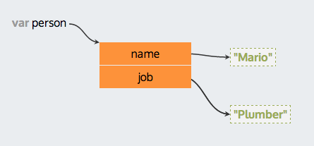
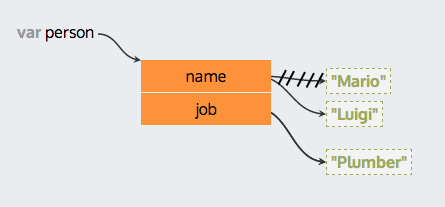

# Lesson 9: Objects

JavaScript has two built-in [associative array](//en.wikipedia.org/wiki/Associative_array) data types to help us store and work with collections of values: Objects, which are collections of values accessible at arbitrary string keys, and Arrays which are collections of values accessible at sequential integer keys. We'll go over Objects today, and Arrays in our next lesson (because they're actually just objects!)

**Note:** There are many code snippets in this lesson. Please try them all out on your own, but do **not** copy and paste them.

This is an object:

```javascript
var person = {
  "name": "Mario",
  "job": "Plumber"
};

person["name"]; // "Mario"
person["job"]; // "Plumber"
```



We can use the bracket syntax to access and set values

```javascript
person['name'] = 'Luigi';
```



We can declare empty objects and assign key-value pairs later

```javascript
var person = {};

person["name"] = "Mario";
person["job"] = "Plumber";

person["name"]; // "Mario"
person["job"]; // "Plumber"
```

#### Exercise 1:

Create a variable called `myCat` and assign it these properties (& appropriate values of your choosing):
1. A `name` property, which should hold a string value
2. An `age` property holding an integer value
3. An `isAlive` property holding a boolean value
4. Add at least two more properties such as `favoriteToy`, and/or `nappingSpot`

**Note:** Because property keys are always string values, quotation marks are optional:

```javascript
var person = {
  "name": "Mario",
  "job": "Plumber",
  "age" : 55,
  "licensed": true
};

//this does the same thing
var person = {
  name: "Mario",
  job: "Plumber",
  age : 55,
  licensed: true,
  'a key with spaces-and-dashes can be used': 'but always need to have quotes'
};
```

Often times we access properties of our objects using variables instead of string literals:

```javascript
var human = {};
human['name'] = 'bob';
human['age'] = 75;

var property = 'age';

// What property key are we referencing here? What is its value?
human[property];

property = 'location';

// At what key will we find the value "San Francisco"?
// Test it out to make sure you're right.
human[property] = 'San Francisco';
```

#### Exercise 2:

1.  Create a variable called `myDreamLife` and assign to it an empty object.
2.  Create a variable called `propertyKey` and assign to it the string value `"job"`.
3.  Use the `propertyKey` variable, not the literal string `"job"` to add a `job` property to your dream life object. Hint: `myDreamLife[propertyKey] = 'some job'`.
4.  Create a variable `anotherPropertyKey` and give it a value "salary".
5.  Use `anotherPropertyKey`, not the literal string `"salary"`, to quantify the value of human life (i.e. a salary).
6.  What does `myDreamLife[propertyKey]` return?
7.  What does `myDreamLife["job"]` return?
8.  Assign a string `"car"` to the variable `nextProperty`.
9.  Use the variable `nextProperty` to add your dream car to your dream life object.
10.  What does `myDreamLife[nextProperty]` return?
11.  What does `myDreamLife["car"]` return?
12.  Assign `myDreamLife` three more properties (with values) using variables rather than literal strings and access them each using variables as well.

## Dot Notation

We use the `person["job"]` syntax so often, JavaScript decided to include a more confusing way to do the same thing: `person.job`. It's called **dot notation** as opposed to the **bracket notation** we used earlier.

```javascript
var car = {
  make: "Toyota"
};

car["model"] = "Camry";
car["model"]; // what does this evaluate to?
car.model; // what does this evaluate to?

car.model = "Prius";
car["model"];
car.model;

var prop = 'year';

// how can we set the car's year using the variable prop?
```

#### Exercise 3:

1.  Which should we use above: `car[prop] = 1992` or `car.prop = 1992`? Try both ways!
2.  What happens when you ask for a property that is not registered to the object? i.e. to what value does the expression `car['nothingHere']` resolve to? what about `car.nothingHere`?
3.  Create your own `dreamCar` object.
4.  **Use dot notation** to add properties `make`, `model`, and `color` with values of type string, `year` with a value of type number, and `registered` with a value of type boolean.

#### Exercise 4:

On lines ending '??', figure out what the expression will evaluate to. **First form a hypthosis**, then **try it in the console**.

```javascript
var demo_object = {
    one: 1,
    two: 2,
    three: 3
};
var one = "three";

demo_object['two']; // ??
demo_object[one]; // ??

var state_capitals = {
    California: 'Sacramento',
    Texas: 'Austin'
};

var place = 'California';

state_capitals['place'] // ??
state_capitals.place   // ??
state_capitals[place] // ??

state_capitals['California']; // ??
state_capitals.California;   // ??
state_capitals[California]; // ??
```

Sometimes we'll want to iterate over every property in an object. Since we don't know the names of the keys beforehand, and the keys aren't sequential integers, we can't use a while loop. There is a special language-level statement to handle this, the `for in` loop.

```javascript
var obj = {
    greeting: 'howdy',
    direction: 'down',
    color: 'red',
};

for (var key in obj) {
    console.log(obj[key]) //why don't we need quotes around key?
    // what would happen if we logged obj.key instead? Why? Test it.
};
```

**Note:** In each iteration of the `for in` loop, the variable `key` holds a string that is one of the keys in the object. In the code snippet above, you can think of the code as evaluating to each of these lines respectively, as it moves through the loop:

1. `console.log(obj['greeting']);`
2. `console.log(obj['direction']);`
3. `console.log(obj['color']);`

#### Exercise 5:

1.  Use a `for in` loop to iterate over your `cat`, `dreamCar` and `dreamLife` objects. Re-write the loop from scratch each time and use a variable name other than `key` for each one.
2.  Use a `for in` loop to search `obj` for the key `color` and print its value to the console.
3.  Create a variable `targetKey` and assign it a string `"greeting"`. Use the `targetKey` variable and `for in` to find the `greeting` property and log its value. **Hint:** On each iteration of the loop, check if `key` is equal to `targetKey`.

#### Exercise 6:

```javascript
var politicians = {
    secretary_of_state: 'hillary clinton',
    potus: 'barack obama',
    flotus: 'michelle obama',
    vice_prez: 'joe biden',
    gov_of_california: 'jerry brown'
};
```

1.  Loop through the politicians object and concatenate everyone's names together, separated by a space. Final result should look something like this: 'hillary clinton barack obama michelle obama joe biden jerry brown'
2.  Loop through the politicians object again, but this time print the data in the following format: `position: name`. The end result should look like this:

`secretary_of_state: hillary clinton`

`potus: barack obama`

`flotus: michelle obama`

`vice_prez: joe biden`

`gov_of_california: jerry brown`

#### Exercise 7:

1.  Create a new empty object called `reverse_politician_lookup` by iterating over the politicians object and adding each person to the `reverse_politician_lookup` object with their name as a key and their job title as the value. The final object should look something like this:

```javascript
var reverse_politician_lookup = {
    'hillary clinton': 'secretary_of_state',
    'barack obama': 'potus',
    'michelle obama': 'flotus',
    'joe biden': 'vice_prez',
    'jerry brown': 'gov_of_california'
};
```

### Complex Objects

Objects can hold values of any data type. That includes arrays, functions (we'll learn about both of those soon), and even objects.

```javascript
var complex_object = {
  string: "I'm a string!",
  number: 42,
  //don't worry about this too much yet, just accept thats its a different data type
  array: ["all sorts of stuff", 10, true, undefined, function(){console.log('beepity-beep')}],
  //we haven't covered functions yet either, just accept that they too can be stored in objects
  fn: console.log,
  //Now THIS is interesting, an object INSIDE of an object!?
  simple_object: {name: 'bob', location: 'basement', happy: 'false'},
};

complex_object.string;
complex_object.array;
complex_object.simple_object.name;
complex_object.fn("print me!");
```

#### Exercise 8:

1. Try console logging all of the values in `complex_object`
2. `simple_object` is an object inside of an object. How might we access its properties? Try to console log the value of the "name" property inside of simple_object (which is nested inside of complex_object)
3. Try to use a `for in` loop to console log all of the properties inside of `simple_object`
4.  Create your own complex object. How deep can you nest objects inside of each other? Are you still able to access the properties of the nested object?

## Extra Credit

### Pass by Reference

We learned earlier that primitives like numbers and strings are **pass by value**. This means that if we assign one variable equal to another, each variable receives its own copy of the primitive value, and changing one variable does not affect the other:

```javascript
var fruit1 = "apple";
var fruit2 = fruit1;

console.log(fruit1); // "apple"
console.log(fruit2); // "apple"

fruit1 = "tomato";

console.log(fruit1); // "tomato"
console.log(fruit2); // "apple"
```

Object, on the other hand, are **pass by reference**. This means that when you set one variable (that references an object) equal to another, they both point to the same **instance** of the object, and if you modify the object via one variable, it will be reflected in the other. For example, try the following:

```javascript
var the_one_true_object = {
  name: 'Neo',
  status: 'The One',
  mentor: 'Morpheus',
  sunglasses: true,
  trenchcoat: true
}

var the_same_object = the_one_true_object;

// These two should print the same thing, nothing new here yet
console.log(the_one_true_object);
console.log(the_same_object);

the_one_true_object.sunglasses = false;
the_one_true_object.trenchcoat = false;

// Should output the object with the changes we made above.
console.log(the_one_true_object);

// What do you expect here?
console.log(the_same_object);
```
What did you learn? Play around with this concept some more in your console until you understand it. Mix and match between objects and primitives to get a feeling for how they each behave.

### Everything is an object

Did you know that almost every data type in Javascript is an object? Puzzle over this:

```javascript
//strings
typeof "asdf"; // "string"

"asdf".length; // 4

"asdf".replace('asdf', 'apple'); // "apple"

//numbers
(10).toString; // "10"
```

The above examples demonstrate that almost everything in JavaScript is an object, with properties and methods. However, primitives don't behave exactly like regular objects because they are immutable. This means that you can't directly add or remove properties. Try this:

```javascript
var testString = 'Hello'; // "Hello"
testString.greeting = 'Welcome!'; // "Welcome!"

console.log(testString.greeting); // undefined
```

That's pretty straightforward, but what about this:

```javascript
var testString = 'Hello'; // "Hello"
testString.constructor.prototype.greeting = 'Welcome!' // "Welcome!";

console.log(testString.greeting); // "Welcome!"
```

To understand why *that* worked you'll have to dive deep into the strange and mysterious world that is JavaScript prototypical inheritance. [This](http://eloquentjavascript.net/06_object.html) is a great place to start.

**Note:** Classes and inheritance work much differently in JavaScript than they do in other programming languages. The reading above will help elucidate that.

## Additional Reading

A more generalized form of storing key-value pairs is called a [hash table](https://en.wikipedia.org/wiki/Hash_table). This is a fundamental computer science data structure, and its well worth your time to learn about how it works! [This](https://www.youtube.com/watch?v=MfhjkfocRR0) video might be helpful.
