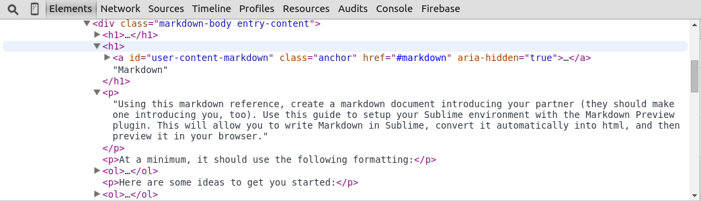
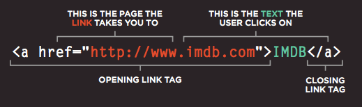

# Lesson 1: Welcome, the Internet, and Markdown

#Markdown
Using this [Markdown Reference](../../resources/markdown_reference.md), create a markdown document introducing your partner (they should make one introducing you, too). Use [this guide](../../resources/sublime.md) to setup your Sublime environment with the Markdown Preview plugin. This will allow you to write Markdown in Sublime, convert it automatically into html, and then preview it in your browser.

At a minimum, it should use the following formatting:
  1. Headers of several different sizes
  2. Italic text
  3. Bold text
  4. Strikethrough text
  5. An unordered list
  6. An ordered list
  7. A "horizontal rule" delimiter
  8. A link to a web page
  9. A link to an image on the web
  10. A link to an image on your computer

Here are some ideas to get you started:

  1. A profile image
  2. A short Bio.
  3. Some simple questions:
    - What is your programming background?
    - Why do you want to learn to code?
    - What are your goals for this course specifically?
  4. Some links to interesting websites.

When you are done, message me with a link to your work, saved as a [gist](https://gist.github.com/)

Using gist:
  1. Give your gist a description and a title.
  2. Paste your entire code into the large text box.
  3. Change the 'Langauge' to 'Markdown' (make sure your file name ends in '.md')
  4. Click 'Create public Gist'
  5. Send the link to the document through Slack

#HTML

HTML is a **markup** language for describing the **structure** and **content** of web documents (web pages). It is comprised of markup **tags** and text content nested inside each other.

### HTML Tags
HTML tags are **keywords** (tag names) surrounded by **angle brackets**

``` html
<tagname>content</tagname>
```

### A small HTML file
As written by the programmer in a code editor, it is an inert document - data sitting on the hard drive - until its code is *executed* by an interpreter:

```html
<!DOCTYPE html>
<html>
  <head>
    <title>Page Title</title>
  </head>
  <body>
    <h1>My First Heading</h1>
    <p>My first paragraph.</p>
  </body>
</html>
```

### Web Browsers
The purpose of a web browser (we'll be using Chrome for the remainder of this course) is to read HTML documents and display them (among other things.)

### Reading and Parsing
By following the proscribed rules of HTML, a web browser understands this to be a document with a heading and a paragraph. Here is what the browser *interpreter* thinks when given this code:
* The **DOCTYPE** declaration defines the document type to be HTML.
* The text between **&lt;html&gt;** and **&lt;/html&gt;** describes an HTML document.
* The text beteen **&lt;head&gt;** and **&lt;/head&gt;** provides information about the document. This is called meta-data (data that describes data.)
* The text between **&lt;title&gt;** and **&lt;/title&gt;** provides a title for the document.
* The text between **&lt;body&gt;** and **&lt;/body&gt;** describes the visible page content.
* The text between **&lt;h1&gt;** and **&lt;/h1&gt;** describes a heading.
* The text between **&lt;p&gt;** and **&lt;/p&gt;** describes a paragraph.

The browser then *parses* apart the file. The white area below (inside the &lt;body&gt; tag) is the only part of the above code that actually appears in the browser window (what the user sees).

;

The browser builds an in-memory representation of a new web page called a *Document Object Model* AKA the DOM.


The DOM is a tree-like structure where each element on a web page is represented is a **node**. A node that is nested inside of another node is represented as a *child node*.

The browser uses the DOM structure to render the desired output into the browser **window** for the user to see and interact with:


Don't take our word for it though, we can actually look at the DOM directly using the chrome developer tools:
  1. Navigate to any web page
  2. Open up the chrome developer tools
  3. Select the elements panel and play around with the elements there. What happens when you modify them?



**My First Website**
 Using this [HTML reference](example.html), create a personal website about anything you want! Include hyperlinks so that users can navigate the website to learn more about you!

 **Note about links**:

 

 At a minimum, your personal webpage should include the following:
   1. Correctly set up [html documents](https://developer.mozilla.org/en-US/docs/Web/Guide/HTML/Introduction) with a head and body.
   2. A [title](https://developer.mozilla.org/en-US/docs/Web/HTML/Element/title)
   3. All body content should be wrapped in a [div](https://developer.mozilla.org/en-US/docs/Web/HTML/Element/div) (you can use divs in other places too)
   4. Some [header tags](https://developer.mozilla.org/en-US/docs/Web/HTML/Element/Heading_Elements)
   5. Some [paragraphs](https://developer.mozilla.org/en-US/docs/Web/HTML/Element/p)
   6. A "[horizontal rule](https://developer.mozilla.org/en-US/docs/Web/HTML/Element/hr)" delimiter
   7. Some formatted text (i.e. &lt;em&gt;, &lt;strong&gt;, etc.)
   8. One or more [ordered](https://developer.mozilla.org/en-US/docs/Web/HTML/Element/ol) or [unordered](https://developer.mozilla.org/en-US/docs/Web/HTML/Element/ul) lists
   9. Plenty of [images](https://developer.mozilla.org/en-US/docs/Web/HTML/Element/img) (on your computer or on the web)
   10. At least a few [SECRET COMMENTS](https://developer.mozilla.org/en-US/docs/Web/Guide/HTML/Introduction#Comments_and_doctype) that visitors can only see if they view your source code!
   11. Multiple pages (think different sections on a website that you can navigate between using links)

Dont worry too much about it not looking nice for now or everything being perfect, you'll have plenty of time to iterate over this site over the next month, and the more you learn, the more you can add to the website. Also don't get lost in the documentation. Learning to quickly sift through documentation and find what you need is an art of its own, but for today feel free to rely on the provided reference.

**Note:** Remember you can preview your HTML by saving it as a .html file and then opening it in Chrome.

When you are done, Deploy your website to the Internet by following these instructions:

1. Sign up for free Divshot static hosting.
2. Make sure your main page is named index.html, so that it will show up when you visit your divshot sub-domain: myapp.divshot.io
3. Use [CMD + click] multiple times to select all the files and folders you want to upload
4. [CTRL + click] to bring up the context menu, and select "compress files"
5. Create a new app.
6. Scroll down to the production environment and click upload
7. Click in the upload area to bring up the file upload menu. Select the "Archive.zip" compressed file
8. Post your site URL in Slack #general channel for your classmates to check out
9. Open your classmates sites and read their source code, check out what secret comments they've left you. (reading source code is one of the most effective and under-utilized learning strategies)

## Extra Credit
  
1. Read about how [computers](../../resources/computers.md) work.
2. Check out this [HTML reference](https://developer.mozilla.org/en-US/docs/Web/HTML/Element) document which lists all the available HTML tags. We'll cover some of them later- like forms and iframes- but others are too obscure or specialized for us to spend time on, so read up if you're interested.
3. Setup a repository for your website and deploy it onto [GitHub pages!](https://pages.github.com/)

## Additional Research

Look these up on your own if you want to learn more about how the internet works:

1. World Wide Web
2. HTTP
3. DNS
4. REST