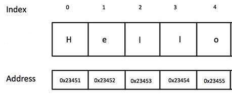

 # Lesson 11: Arrays

Strings are secretly collections of letters stored at sequential memory addresses.



We can access each letter using square brackets and a zero-indexed number. **Try typing out each of the following for yourself, using your own values and variable names:**

```javascript
var word = "Hello";

word[0];
word[1];
word[4];
word[5];

var index = 3;
word[index];

// strings have a length property
var len = word.length;
word[len];
word[len - 1];
```

It works for larger strings too.

```javascript
var greeting = "Hello and welcome to my webpage!"

greeting[0];
greeting[1];
greeting[28];
greeting[29];

var index = 2;
greeting[index];

var len = greeting.length;
greeting[len];
greeting[len - 1];
```

Sometimes we want collections of items more complex than single letters. Here's a collection of numbers contained in a data structure of type array- a data type defined at the language-level by JavaScript.

`var numbers = [99, -5, 82, 65, 39 120, 431, 98, 17, 42]`


```javascript
var nums = [5, 10, 20, 50, 100, 250];

nums[0];
nums[1];
nums[5];
nums[6];

var index = 4;
nums[index];

var len = nums.length;
nums[len];
nums[len - 1];
```

An array of strings:

```javascript
var words = ["Hello", "and", "welcome", "to", "my", "webpage!"];

words[0];
words[1];
words[5];
words[6];

var the_number_three = 3;
words[the_number_three];

var len = words.length;
words[len];
words[len - 1];
```

Arrays can hold all kinds of stuff:

```javascript
var all_kinds_of_stuff = ["Hello", 3, undefined, true, ["woah", "dude"], null];

all_kinds_of_stuff[0];
all_kinds_of_stuff[1];
all_kinds_of_stuff[5];
all_kinds_of_stuff[6];

var another_array = all_kinds_of_stuff[4];

// ?
another_array[0];

// ?
all_kinds_of_stuff[4][1];
```

Okay, now we've seen some arrays, let's create a few of our own.

```javascript
// creating a new instance of an array is called instantiation
var arr = []

// we can use bracket access in conjunction w/ the assignment operator
// to store a new value at that index
arr[0] = "0 is the new 1"
arr[1] = 45
arr[2] = null
arr[3] = true

arr[1] = "overwrite 45, just forget about that one, okay?"
```

### Exercise 1:

1.  Instantiate a new array and save it to a variable `recipe`
2.  Use bracket notation to add the steps to create your favorite meal.
3.  Access the first step of your recipe using bracket notation.
4.  Create variable called `lastStep` and assign to it a number which represents the index of the last item of your array
5.  Access the last step of your recipe using the `lastStep` variable


## Array properties and methods

Arrays have associated with them some properties (just like Objects!), such as `.length`, and methods(these are a type of function, don't worry about what this means too much just yet), like `.push()`, to help us use our collections more effectively.

```javascript
var arr = ['stuff', 'more stuff', 'even more stuff'];

arr.length;

arr.push("More on the end!!!");
var lastItem = words.pop();

arr.unshift("More at the beginning!!");
var firstItem = words.shift();
```

### Exercise 2:

1.  Instantiate a new array and save it to a variable `bucketList`
2.  Use bracket notation with the assignment operator to add two life goals to your array.
3.  `.push()` two goals onto the end of your list.
4.  `.unshift()` two goals onto the beginning.
5.  What is the array's length at this point?
6.  `.pop()` off one goal and save it to a variable `dyingWish`
7.  `.shift()` off one goal and save it to a variable `doItNow`
8.  What is the array's length at this point?


## Looping Through Arrays
Often we want to consider every element in the array in turn.

```javascript
var i = 0;

while (i < words.length) {
  console.log(words[i]);
  i++;
}
```

### Exercise 3:

1.  Use a while loop to console log each item in your recipe and bucket list.
2.  Refactor your code such that the while loop lives inside a function called `appendStrings` that takes an array as an input (argument)
3.  Invoke `appendStrings` twice, passing in `recipe` the first time and `bucketList` the second time
4.  Refactor `appendStrings` such that it takes two arguments: an array of strings, and a string representing the CSS selector of the element into which the strings should be appended. (i.e. `bucketList` may be appended into a `#bucket_output` div)

<code-submission-form id="arrays-append_strings">

<form class="student_code">

#### Submit Your Code

<textarea name="code" id="code_sample" rows="10"></textarea>  
<input type="submit" value="Send"></form>

</code-submission-form>

* * *

    var str = "one two three"
    var arr = str.split(' ')
    var new_str = arr.join(' and a ')

    // now our turn...
    var scrambledPoem = "roses red are bacon crispy i bacon love and is blue violets are"

### Exercise 4:

1.  use `.split(' ')` on `scrambledPoem` and save the result as an array `scrambledArray`
2.  Create a new array `unscrambledArray`
3.  While the length of `scrambledArray` is greater than 0, remove the FIRST and LAST value and store add them to `unscrambledArray`.
4.  Turn the values in `unscrambledPoem` into a string by using the array's native `.join()` method.

<code-submission-form id="arrays-unscramble">

<form class="student_code">

#### Submit Your Code

<textarea name="code" id="code_sample" rows="10"></textarea>  
<input type="submit" value="Send"></form>

</code-submission-form>

* * *

We do this type of iteration so often, that JavaScript provides us a special kind of loop- the `for` loop.

    for (var i = 0; i < words.length; i++) {
      console.log(words[i])
    }

### Exercise 5:

1.  Write a function `reverser` which will take an array of values as an input and return a new array of the same values in reverse order.
2.  Inside `reverser` instantiate a new array `reversedArray`, use a `for` loop to populate it, then return it from the function.

<code-submission-form id="arrays-reverser">

<form class="student_code">

#### Submit Your Code

<textarea name="code" id="code_sample" rows="10"></textarea>  
<input type="submit" value="Send"></form>

</code-submission-form>

* * *

Often it's cleaner to use Array's native `.forEach()` method to run a given function once for each item in the array, passing that item in as an argument

    var logMe = function(word){
      console.log(word)
    }

    words.forEach(logMe)

**Exercise:** Refactor your `appendStrings` function to use `.forEach()` instead of a `while` loop.

**Exercise:** Write a function `biggestSmallest` that takes an array of numbers as an input, uses `.forEach()`, and returns an array containing the smallest number in the zeroth position and the largest number in the first position.

<code-submission-form id="arrays-biggest_smallest">

<form class="student_code">

#### Submit Your Code

<textarea name="code" id="code_sample" rows="10"></textarea>  
<input type="submit" value="Send"></form>

</code-submission-form>

* * *

Arrays are pass by reference, this means when you do the following, you get two arrays pointing at the same object in memory. This can lead to the unexpected results

    var arr2 = arr
    arr2.pop() // both arr and arr2 are changed!!

    var arr3 = arr.slice() // clones the array
    arr3.pop() // only arr3 is changed

**Exericise:** Create a function arrayDuplicator, that takes an array as an input, and returns a copy as the output.

    var arrayDuplicator = function(inputArray) {
        var outputArray = []

        // code here

        return outputArray
    };

    var original = [1, 2, 3, 4]
    var duplicated = arrayDuplicator(original)

    duplicated.pop()
    duplicated.pop()
    duplicated.pop()

    console.log(original, duplicated) // should not be the same!

<code-submission-form id="arrays-array_duplicator">

<form class="student_code">

#### Submit Your Code

<textarea name="code" id="code_sample" rows="10"></textarea>  
<input type="submit" value="Send"></form>

</code-submission-form>

* * *

`.concat()` is short for concatinate. It smooshes two arrays together.

    var friends = ['ada', 'will', 'bianca', 'abe']
    var enemies = ['john', 'alice']

    var frenemies = friends.concat(enemies)

    console.log(frenemies)
    console.log(friends, enemies) // does not change original arrays!

**Exericise:** Write a function `arrayCombiner` that takes two arrays as inputs and returns the two of them smooshed together as an output

    var arrayCombiner = function(array1, array2) {}

    var combinedArray = arrayCombiner([1, 2, 3], [4, 5, 6])
    console.log(combinedArray)

<code-submission-form id="arrays-concat">

<form class="student_code">

#### Submit Your Code

<textarea name="code" id="code_sample" rows="10"></textarea>  
<input type="submit" value="Send"></form>

</code-submission-form>

* * *

`.splice()` is another confusing one. It destructively removes a number of elements from an array starting at a particular index.

    var frenemies = ['ada', 'will', 'bianca', 'abe', 'john', 'alice']
    var startingAtIndex = 3
    var numberToRemove = 2

    var removedElements = frenemies.splice(startingAtIndex, numberToRemove);

    console.log("We took out ", removedElements)
    console.log("The remaining array ", frenemies)

**Exercise:** Write a function `arrayPlucker` that takes an array and an index as inputs and destructively removes the single value at that index. Return that value.

    var arrayPlucker = function(array1, indexToRemove) {
        var removedValue
        // code here
        return removedValue
    }

    var daysOfSchool = ['Monday', 'Tuesday', 'Wednesday', 'Thursday', 'Friday']

    var dayOff = arrayPlucker(daysOfSchool, 4)

    console.log("I'll go to school on: ", daysOfSchool)
    console.log("but I'm taking vacation on ", dayOff)

<code-submission-form id="arrays-splice">

<form class="student_code">

#### Submit Your Code

<textarea name="code" id="code_sample" rows="10"></textarea>  
<input type="submit" value="Send"></form>

</code-submission-form>

* * *

    var rand = Math.floor( Math.random() * words.length )
    words[rand]

#### Exercise: Magic 8-ball

1.  Create a Magic 8-ball that allows a user to type a question into an input field.
2.  When the user clicks the "ask question" button, register a click handler function that randomly selects a reply from an array of appropriately vague stock phrases.
3.  Display the answer inside a glowing circle or something crazy like that.
4.  Allow the user to click an "ask again" button which clears their previous question and output.
5.  Refactor your code so that the user doesn't receive the same reply twice until all the replies have been used at least once.

**Exercise: Shuffler** Create a function `shuffler` that takes an array as input and returns a new array of the same elements in a random order. Is your shuffle perfectly mathematically random or only pseudo-random? How computationally efficient is it- i.e. how many lines of code need to be run?

<code-submission-form id="arrays-magic_8_ball">

<form class="student_code">

#### Submit Your Code

<textarea name="code" id="code_sample" rows="10"></textarea>  
<input type="submit" value="Send"></form>

</code-submission-form>

* * *

#### More Exercises:

1.  Write a function that takes an array of values and returns an boolean representing if the word "hello" exists in the array.
2.  Write a function that takes an array of values and a target value and returns how many times that target value exists in the array.
3.  Write a function that takes an array and returns a new array containing only the values at odd indexes in that array.
4.  Write a function called `sumArray` that takes an array of numbers and returns the sum of all of those numbers added together.
5.  Write a function called `arrayMath` that takes an array of numbers and a string with a mathmatical operator and applies that operator to all the numbers together. `arrayMath([4,2,3], "*")` should return `24`
6.  Write a `zipper` function that combines two arrays in alternating order, `zipper([1,2,3],['a','b','c'])` should return `[1, 'a', 2, 'b', 3, 'c']`. Make sure to handle cases where one array is longer than the other.
7.  Write a function that merges two sorted lists into a new list. `mergeSorted([1, 2, 5, 9], [3, 7, 19])` should return `[1, 2, 3, 5, 7, 9, 19]`
8.  Write a function that creates an array of the first 100 Fibonacci numbers.

<code-submission-form id="arrays-more_arrays">

<form class="student_code">

#### Submit Your Code

<textarea name="code" id="code_sample" rows="10"></textarea>  
<input type="submit" value="Send"></form>

</code-submission-form>

* * *

#### Exercise: Magnetic Poetry

1.  Have a grid of words in span.word tags for the user to select from.
2.  Allow users to click on the spans to add that word to a sentence array.
3.  When the user clicks on a "make sentence" button use `words.join(' ')` to create a string and show it.
4.  Create a "show magic word" button. If the user has used a particular magic word in their sentence highlight it for them. Otherwise, tell them that they have not used the magic word.
5.  Have an array of magic words, color the magic words differently.
6.  Allow users to create multiple sentences. Store all of the sentences in an array.
7.  Have "magic word" work on all sentences at once.

<code-submission-form id="arrays-magnetic_poetry">

<form class="student_code">

#### Submit Your Code

<textarea name="code" id="code_sample" rows="10"></textarea>  
<input type="submit" value="Send"></form>

</code-submission-form>

* * *

### [Optional Content] Advanced Concepts in Arrays

    var arr = [52, 27,31]

    // pass by reference
    arr2 = arr
    arr2.push(44)
    arr[0] = "new value"

    // why?
    console.log(arr, arr2)

    // what does slice do?
    arr2 = arr.slice()
    arr2.push(44)
    arr[0] = "new value"

    // why?
    console.log(arr, arr2)

    var arr = [ ['hello', 'and', 'hi'], [2,3,4] ]
    arr2 = arr.slice()
    arr2[1].push(44)
    arr[0] = "new value"

    // ?
    console.log(arr, arr2)

* * *

    var arrayOfFunctions = [ function(){ console.log('hi') }, function(){ console.log('bye') } ]

    arrayOfFunctions.push(function(val1){ console.log(val1 * 2) })

    var adder = function(val1, val2){ console.log(val1 + val2) }
    arrayOfFunctions[3] = adder

    arrayOfFunctions.forEach(function(func){
      func(3,4)
    })

* * *

    // Reimplementing JavaScript Array's native .forEach() method is rather trivial
    var myEach = function (array, iterator) {
      for (var i = 0; i < array.length; i++){
        iterator( array[i], i )
      }
    }

    myEach(someArray, someFunction)

</section>

</div>
