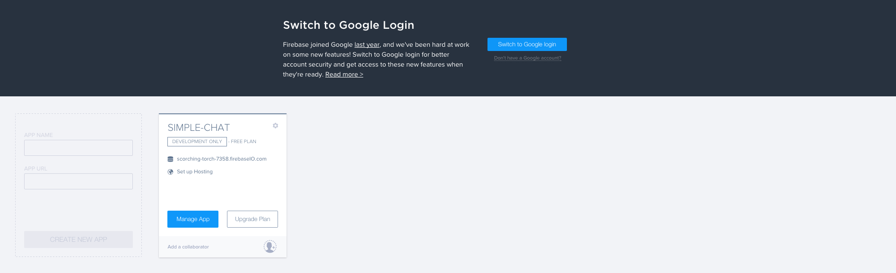
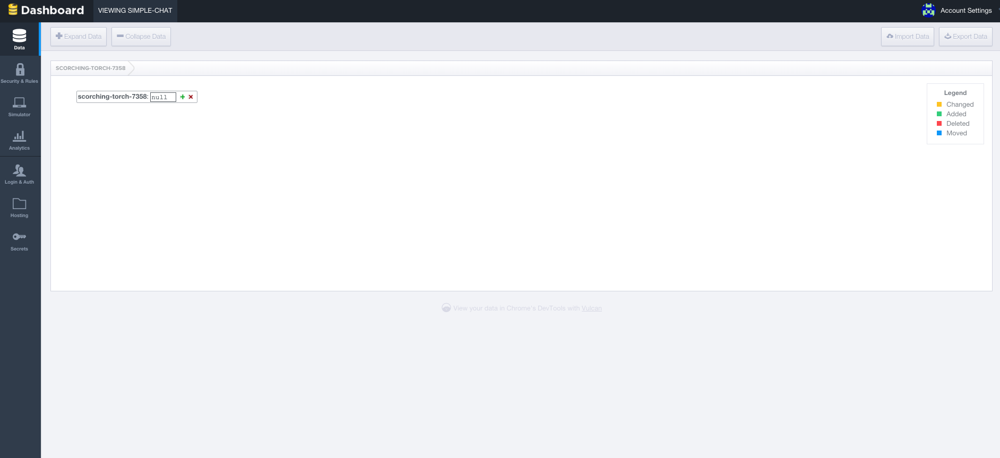

# Firebase


Firebase is a prebuilt, event-driven, real-time database.  In contrast to other database services, like MongoDB or MySQL, this one is hosted in the cloud by the guys at Firebase.  In other words, you don't have to worry about server hardware and software; Firebase has got you covered.  

Firebase operates in **real time**.  Whenever new data is added to your Firebase, it is automatically updated for all the clients watching that data.  These clients can be web browsers, mobile devices, or any other application which can make use of a backend. This makes Firebase ideal for apps like chat services, online image editors, forums, and anything else that can use snappy response times.

One of the coolest things about Firebase is that it can be coded **entirely in client-side Javascript**.  You don't need to learn any server-side specific languages, libraries, or frameworks, like Node.js or PHP. We can get started with Firebase right now, using what you already know - so let's do that just that.

## Getting Started

1. Create an account right [here](https://www.firebase.com/).
2. Navigate to your [account page](https://www.firebase.com/account/#/).
3. Your account page is where you'll find all your Firebase apps.  Let's go ahead and click on "Manage Apps".



Once you've done that, you should see this:



This is your Firebase app.  This is where all your data is stored and accessed.  Keep this page open; we'll be coming back here often.

Now you're ready for Firebase's [five minute tutorial](https://www.firebase.com/tutorial/#gettingstarted).  It's the fastest way to get a basic grasp of Firebase's capabilities, and it comes right from the horse's mouth (so you know it's good).

## Exercise 1 - Simple Chat

You'll need to make sure to include a `<script>` tag reference to Firebase in your code.  The latest version of Firebase can always be found on their [docs](https://www.firebase.com/docs/web/quickstart.html).

```html
<script src="https://cdn.firebase.com/js/client/2.3.1/firebase.js"></script>
<!-- current version as of 10/27/15 -->
```

**Note:** Like formspree, Firebase won't work on a file URL protocol. Make sure you upload your app to divshot or some other hosting service first. Firebase will also work in JSBin/JSFiddle/your online editor of choice.

1. Use HTML and CSS to create a simple chat window.  It should include a window for displaying messages, a text box for typing, and some way to submit messages.
  * A button is fine, but what would be even better is if we could type a message, hit enter, and have it appear.  **Hint:** Check jQuery's [keydown()](https://api.jquery.com/keydown/) and [which()](https://api.jquery.com/event.which/) methods
2. When a user arrives at your chat, it should prompt them for a username.
3. All previous messages should load in the chat window.  
4. The user should be able to type a message into a text box, click a button/hit enter, and see their message appear in the chat buffer, after all previous messages.  Their message should display with a `username: message` format, e.g.
5. Check your Firebase database! It will update in real time whenever you push, set, or otherwise add or remove new date to it. Try watching your database while other people are using your chat app.

```
john: it's good to be here.
jane: it's good to have you here.
```

The easiest way to test your app is just to open it up in multiple web pages, in order to simulate multiple clients accessing the database. However, you're lucky enough to be sitting in a room full of testers. Share your app's link with the folks in the room, and get them mucking about in your code.

### Extra Credit

1. Don't allow duplicate usernames or empty strings.
2. Introduce a password system. If a new user enters, prompt them to create a password.  If a user submits a username that already exists, prompt them to enter the password associated with that username, and deny them entry if they do not enter it correctly.
3. Allow users to select the color their messages display in. **Note:** this color choice should persist if the user leaves and reenters the chat with the same name.
  * **Bonus:** Allow users to choose a "random" option, which generates a random color for them
4. Create a "chat bot" that announces whenever a user enters or leaves the chat room. **Hint:** detecting user exit is a bit trickier than detecting entrance. This is a **presence system**. Check out the [firebase docs](https://www.firebase.com/docs/web/guide/offline-capabilities.html) for tips on how to accomplish this.
