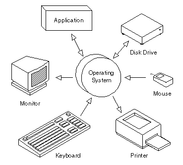
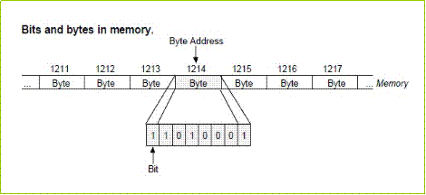
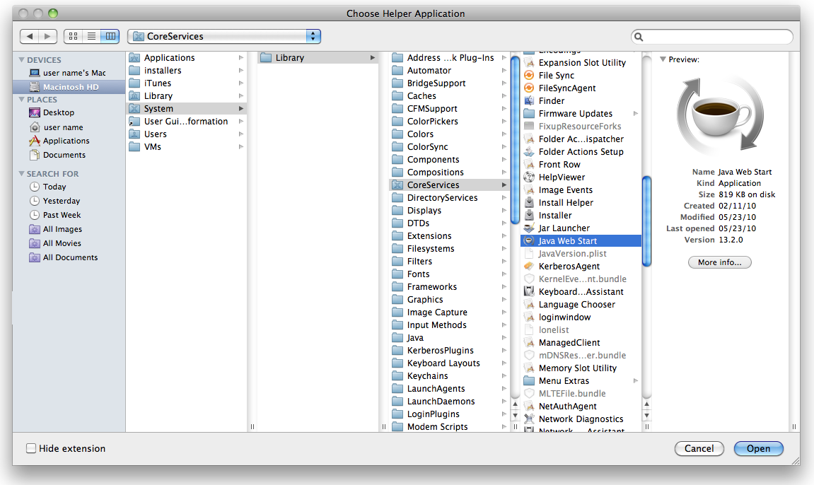

# A little about computers...

A computer is essentially an adding machine wired to a clock that ticks/ performs a simple calculation a couple billion times a second, querying and saving back data to a storage device (hard drive or memory) as it goes. [Learn More](http://www.simplecpu.com/Binary.html).

## Operating System

The operating system is the program (series of instructions) that runs when you turn on your computer. It handles inputs (keyboard, mouse, camera, network connections) and outputs (monitor, speakers, network connections), manages shared access to computing resources and memory, and reads and writes data to the file system on behalf of any number of simultaneously running applications (web browser, code editor, text document, music player, etc)

## User Interfaces

Computers can receive user input through either a command line interface (CLI) or a graphical user interface (GUI).

In a command line interface (A.K.A. "Console", "Terminal", or "Shell"), the user types commands using the keyboard to tell the computer to take an action. The computer will display the results of the operation by writing text to the screen.

In a graphical user interface, the mouse is used to interact with skeuomorphic (emulating appearance of physical objects) icons to open files and applications, navigate the file system, or change settings as well as input text through the keyboard which is passed to the currently "focused" element (such as the body of an email or the URL bar in your browser).

Graphical user interfaces are generally thought easier to use. Command lines allow programmers more powerful and fine-grained control over their computers.

## File System

The file system organizes the data stored on your hard disk. The underlying storage mechanism has no concept of a file, it only knows of disk blocks, containing binary data, numbered sequentially by their memory address.

The file system does the translation between the formless series of 1's and 0's and the data structures the users interact with (files organized in folders).

