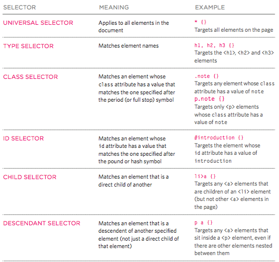

# Query Selector Quick Reference

This reference only scratches the surface of what you can do with query selectors. You can use these examples as building blocks to construct very elaborate selectors.

The image below is a summary of how query selectors can be structured to do different things, and its followed by a more in-depth explanation of how they work.



## Simple Selectors

### Selecting elements by their name

Specify the element name, but without the brackets. For example, you can select all `<p>` tags with the query selector: 'p'

Similarly, all divs can be selected with the query selector: `div`

### Selecting elements by their class

Use a `.` to specify that you want to select all elements of a specific class. For example, `.important` will select all elements with a class of "important".

### Selecting elements by their id

Use a `#` to specify that you want to select the element (there should only be one) with a specific id. For example, `#menu` will select the element with an id of "menu".

## Complex Selectors

### Selecting elements by their name and class

You can select all elements with a certain name *and* class by simply combining the two simple selectors. For example, you can select all `<p>` elements with a class of "important" with the following selector: `p.important` Make sure you don't insert any spaces between the two different selectors; that means something else, as we'll see in the next section.

**Note:** You don't need to do this for element ids because there should only be one element with any given id.

### Selecting elements by Nesting Pattern

At some point, you may want to be able to select elements based on their hierarchy in the dom. For example, if you wanted to select a `<li>` element that is a child of a `<ol>` element that is a child of an element with a class of "#nav", you could do so by specifying a query selector with each of those individual selectors separated by a **space**: `#nav ol li`

Note that in the above example, the nesting doesn't have to be for direct children. For example, the query selector `#nav ol li` will work in this example:

```html
<div id="nav">
  <div>
    <ol>
      <div>
        <li>Hi</li> // This one will be selected
      </div>
    </ol>
  </div>
</div>
```

However, if you want to only select direct descendants of an HTML element, use a `>` instead of a space.

For example, the query selector `#nav>ol>li` will not work for the example above, but it will work for the following:

```html
<div id="nav">
  <ol>
    <li>Hi</li> // This one will be selected
  </ol>
</div>
```

### Selecting Elements that Match One of Multiple Query Selectors

You can select all elements that match one or more patterns by separating multiple query selectors with commas. For example, you can select all `<h1>` elements, as well as all `<p>` elements, with a query selector like this: `h1, p`
